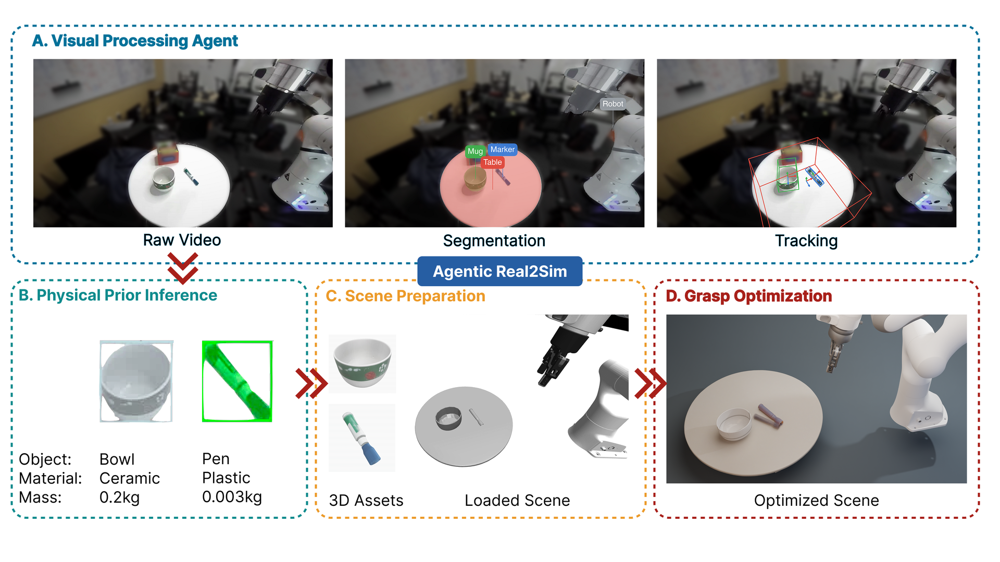

# Agentic Real2Sim

### Physics-based world modeling with vision-language agents

<p align="center">
  <a href="https://arxiv.org/abs/2607.19190"></a>
  
  
  <a href="https://agentic-real2sim.github.io/"></a>
</p>

Agentic Real2Sim turns a real-world recording of robot-object interaction into a
runnable simulation episode. It recovers the scene, object geometry, object
poses, robot motion, and useful physical properties; builds the scene in
MuJoCo; and refines the setup in the simulator. The resulting episode can be
used to generate data for downstream policy fine-tuning.

The same design covers rigid-object manipulation, deformable-object interaction,
and humanoid motion. The agent decisions can run with a frontier VLM or an
open-weight VLM, selected through a small YAML config. In the paper, the
open-weight option reaches comparable conversion success at a much lower model
cost, while the converted episodes support custom scenes and downstream policy
fine-tuning.

<p align="center">
  <video src="assets/media/promotion_26-08-06.mp4" controls muted loop playsinline width="100%">
    <a href="assets/media/promotion_26-08-06.mp4">Open the promotional video</a>
  </video>
</p>

<p align="center">
  <a href="assets/media/promotion_26-08-06.mp4">Download or open the promotional video</a>
</p>

<p align="center">
  
</p>

<p align="center"><em>Figure 1. A recorded interaction becomes a simulatable twin through visual processing, physical-prior inference, scene preparation, and simulator-in-the-loop grasp optimization.</em></p>

[Installation](#installation) · [Data preparation](#data-preparation) · [Running the pipeline](#running-the-pipeline) · [Artifacts](#artifacts) · [Code structure](#code-structure) · [VLM backends](#vlm-backends)

## Installation

The full pipeline is designed for a Linux machine with an NVIDIA GPU. You will
also need Python 3.12+, conda or Miniforge, `gcc`, `g++`, and CMake. Custom
AIRBOT data additionally needs the ZED SDK and a local ZED calibration file.

From the repository root, create a base environment and the four visual-tool
environments:

```bash
source "$(conda info --base)/etc/profile.d/conda.sh"

export AR2S_CONDA_PATH="$PWD/.conda_envs"
export DROID_MODELS_ROOT="$PWD/models"
mkdir -p "$AR2S_CONDA_PATH" "$DROID_MODELS_ROOT"

conda create --prefix "$AR2S_CONDA_PATH/droid_sim" python=3.12 -y
conda activate "$AR2S_CONDA_PATH/droid_sim"
conda install -c conda-forge ffmpeg -y
pip install -r requirements.txt

bash scripts/env_install_visual/precheck.sh
bash scripts/env_install_visual/install_sam3.sh
bash scripts/env_install_visual/install_sam3d.sh
bash scripts/env_install_visual/install_foundation_stereo.sh
bash scripts/env_install_visual/install_foundationpose.sh
```

The base command and visual scripts create these environments:

| Environment | Role |
| --- | --- |
| `droid_sim` | Pipeline control, MuJoCo, scene preparation, and grasp optimization |
| `qianjun_foundation_stereo` | Stereo frame extraction and depth |
| `qianjun_sam3` | Object and robot segmentation |
| `qianjun_sam3d` | 3D mesh recovery |
| `qianjun_foundationpose` | Object pose tracking |

The install uses no root privileges, but it needs a system C/C++ compiler. Plan
for roughly 80 GB of working space for environments, caches, and model files.
Large model checkpoints are not bundled with this repository. Keep downloaded
weights under `models/` (or set `DROID_MODELS_ROOT`) and keep FoundationPose
weights under `third_party/FoundationPose/weights/`.
Some SAM3 and SAM3D checkpoints are gated; accept the upstream terms and set
`HF_TOKEN` before their first download.

The repository also contains [`scripts/setup.sh`](scripts/setup.sh), a
convenience installer for the complete checkout. All integrated source trees
are already included under `third_party/`; the installer does not access
external source repositories or initialize Git metadata.

### VLM backends

The YAML file selects the model and provider. API-key variables only provide
credentials; they do not select a backend.

| Backend | Example config | Credential |
| --- | --- | --- |
|  Anthropic Claude | [`config_anthropic_opus47.yaml`](ar2s/agent_configs/config_anthropic_opus47.yaml), [`config_sonnet.yaml`](ar2s/agent_configs/config_sonnet.yaml) | `ANTHROPIC_API_KEY` |
|  OpenAI GPT | [`config_openai_gpt54.yaml`](ar2s/agent_configs/config_openai_gpt54.yaml), [`config_openai_gpt55.yaml`](ar2s/agent_configs/config_openai_gpt55.yaml) | The `credential_env` in the selected YAML file |
|  Qwen via OpenRouter | [`config_orouter_qwen.yaml`](ar2s/agent_configs/config_orouter_qwen.yaml) | `OPENROUTER_API_AR2S_KEY` |
|  Google Gemma via OpenRouter | [`config_orouter_gemma4.yaml`](ar2s/agent_configs/config_orouter_gemma4.yaml) | `OPENROUTER_API_AR2S_KEY` |

The default is `config_anthropic_opus47.yaml`. To use another backend, export
its credential and pass the matching file with `--agent-config` when you run
the pipeline.

## Data preparation

### Custom AIRBOT teleoperation data

The pipeline consumes a DROID-shaped `raw_data` folder. A self-collected
AIRBOT episode starts as a ZED recording plus a robot-state stream, so convert
it first:

```text
<episode> or <collection-drop>/
├── camera.svo2                 ZED recording
├── robot.mcap                  AIRBOT state stream
├── episode_manifest.json       task, robot, joint, gripper, and camera metadata
└── station_calibration.json    4x4 T_cam_from_robot_base matrix
```

The manifest is the contract between the recording and the exporter. A compact
AIRBOT Play example is:

```json
{
  "episode_id": "airbot_capture_2026_08_03_episode_3",
  "task_description": "Pick up the spoon and place it on the table.",
  "robot": {
    "model": "AIRBOT Play",
    "mcap_state_topic": "/teleop/left_arm/joint_state/position",
    "mcap_vector_mapping": {
      "vector_length": 7,
      "arm_joint_indices": [0, 1, 2, 3, 4, 5],
      "gripper_index": 6
    },
    "gripper": { "unit": "meters", "valid_range": [0.0, 0.072] }
  },
  "camera": { "serial": "39532546", "source_file": "camera.svo2" }
}
```

`station_calibration.json` must use the same camera serial and declare
`T_cam_from_robot_base`, a 4x4 world-to-camera transform. The exporter pairs
each camera frame with the nearest robot-state timestamp, normalizes the
gripper signal, and writes a DROID-compatible trajectory. AIRBOT Play is
resolved to the bundled `airbot_play` robot profile automatically.

The SVO conversion needs `pyzed`, a CUDA GPU, and the camera's factory
calibration. Put the matching `SN<serial>.conf` file in `ZED_CALIB_DIR`:

```bash
export AR2S_CONDA_PATH="${AR2S_CONDA_PATH:-$PWD/.conda_envs}"
export DROID_MODELS_ROOT="${DROID_MODELS_ROOT:-$PWD/models}"
conda activate "$AR2S_CONDA_PATH/droid_sim"

export ZED_CALIB_DIR=/path/to/zed_calibration

python -m scripts.export_collected_episode \
    /path/to/airbot_episode_or_collection_drop \
    --out-root data/airbot/raw_data \
    --episode-id AIRBOT_success_2026_08_03_21_21_47
```

The converter also accepts a parent directory and converts every
`episode_manifest.json` below it. Use `--robot-type airbot_play` only when the
robot name in the manifest cannot be mapped automatically.

The converted folder has this shape:

```text
data/airbot/raw_data/<episode_id>/
├── <serial>-stereo.mp4
├── <serial>-stereo.K.txt
├── trajectory.h5
├── metadata_<episode_id>.json
├── <episode_id>_cameras.json
└── stage_manifest.json
```

## Running the pipeline

Choose a VLM config, export the matching credential, and run one episode from
the converted `raw_data` directory:

```bash
export AR2S_CONDA_PATH="${AR2S_CONDA_PATH:-$PWD/.conda_envs}"
export DROID_MODELS_ROOT="${DROID_MODELS_ROOT:-$PWD/models}"
conda activate "$AR2S_CONDA_PATH/droid_sim"

export OPENROUTER_API_AR2S_KEY=...       # if using an OpenRouter config

python -m ar2s.run_pipeline \
    --raw-data data/airbot/raw_data/AIRBOT_success_2026_08_03_21_21_47 \
    --agent-config ar2s/agent_configs/config_orouter_qwen.yaml \
    --artifact-root outputs/run_pipeline
```

For a direct OpenAI or Anthropic run, replace the credential and config file.
If `--agent-config` is omitted, the default Anthropic configuration is used.

The stages run in this order:

```text
visual_processing
    → geometry_prior
    → scene_view_repair
    → physical_prior
    → scene_prep
    → grasp_optimization
```

Each stage writes the files needed by the next stage. For a staged run, stop
after a stage and continue later from the same run directory:

```bash
# Visual processing only
export AR2S_CONDA_PATH="${AR2S_CONDA_PATH:-$PWD/.conda_envs}"
export DROID_MODELS_ROOT="${DROID_MODELS_ROOT:-$PWD/models}"
conda activate "$AR2S_CONDA_PATH/droid_sim"

python -m ar2s.run_pipeline \
    --raw-data data/airbot/raw_data/AIRBOT_success_2026_08_03_21_21_47 \
    --agent-config ar2s/agent_configs/config_orouter_qwen.yaml \
    --artifact-root outputs/run_pipeline \
    --until visual_processing

# Continue from geometry priors
conda activate "$AR2S_CONDA_PATH/droid_sim"

python -m ar2s.run_pipeline \
    --raw-data data/airbot/raw_data/AIRBOT_success_2026_08_03_21_21_47 \
    --agent-config ar2s/agent_configs/config_orouter_qwen.yaml \
    --artifact-root outputs/run_pipeline \
    --start-from geometry_prior
```

For a quick GPU check, `--heavy-max-frames N` limits the per-frame depth and
pose models. It does not skip the rest of the sequence, so use it for a smoke
test rather than as a shortened experiment.

## Artifacts

By default, one episode is written to
`outputs/run_pipeline/<episode_id>/`. Use `--artifact-root` or the
`AR2S_RUN_PIPELINE_ROOT` environment variable to move this root.

```text
outputs/run_pipeline/<episode_id>/
├── raw_episodes/       run-local copies or links of the input recording
├── visual_<id>.py      generated VisualInput entry point
├── seq/                extracted frames, depth, masks, and tracks
├── segmentation/       segmentation outputs
├── meshes/             recovered meshes and mesh metadata
├── poses/              tracked object poses
├── state.json          state shared by the pipeline stages
├── logs/               agent and stage logs
├── sysid_inputs/       finalized, simulator-ready episode bundle
└── artifacts/          grasp sweeps or grasp-loop results
```

The most useful files are:

| File or directory | What it contains |
| --- | --- |
| `sysid_inputs/manifest.yaml` | The final scene description consumed by the simulator |
| `sysid_inputs/objects/` | Object meshes, scales, physical parameters, and tracked poses |
| `sysid_inputs/real/` | The real first frame, video, and optional robot mask |
| `sysid_inputs/cameras/` | Camera intrinsics and world-to-camera extrinsics |
| `sysid_inputs/geometry_priors.json` | Geometry and orientation hints inferred from the scene |
| `sysid_inputs/physical_priors.json` | Material and mass estimates used by scene preparation |
| `sysid_inputs/calibration.yaml` | Calibrated robot/object/camera scene state |
| `artifacts/sweep-*/` | Grasp samples, summaries, USD scenes, and successful rollout videos |

The default run performs cleanup at the end to pack or remove intermediate
files that can be regenerated. Use `--no-cleanup` when you need the raw stage
layout, `--no-success-videos` to reduce video output, or `--no-usd` to skip USD
export.

## Code structure

| Path | Purpose |
| --- | --- |
| [`ar2s/run_pipeline.py`](ar2s/run_pipeline.py) | Fixed-order runner for the complete pipeline |
| `ar2s/agents_visual/` | Video ingestion, segmentation, mesh recovery, tracking, and visual-state emission |
| `ar2s/agents_geometry_prior/` | Object orientation, scale, and geometry-prior inference |
| `ar2s/agents_physical_prior/` | Material and mass inference from visual evidence |
| `ar2s/agents_sysid/` | Scene calibration, simulation, grasp probing, and grasp optimization |
| `ar2s/droid_sim/` | MuJoCo scene builders, robot profiles, pose alignment, and USD export |
| `ar2s/agent_configs/` | YAML model/backend selection and provider adapters |
| [`scripts/export_collected_episode.py`](scripts/export_collected_episode.py) | AIRBOT/ZED/MCAP to DROID-shaped `raw_data` conversion |
| [`scripts/setup.sh`](scripts/setup.sh) | One-shot installer using the source trees bundled under `third_party/`; the minimal release uses the explicit installation steps above |
| `assets/robot/` | Bundled Franka and AIRBOT robot models |
| `third_party/` | Perception and simulation dependencies used by the pipeline |

The main entry point is `python -m ar2s.run_pipeline`. Start with the
`ar2s/agents_visual/` input and output contracts when adding a new camera or
robot; start with `ar2s/droid_sim/scene/robot_profile.py` when adding a new
robot profile.

## Citation

If Agentic Real2Sim is useful in your work, please cite:

```bibtex
@misc{chen2026agenticreal2sim,
  title         = {Agentic Real2Sim: Physics-based World Modeling with Vision-Language Agents},
  author        = {Guanxiong Chen and Qianjun Xia and Jiawei Peng and Heng Zhang and Bole Ma and Justin Qian and Ziyi Jiao and Bingyang Zhou and Luoxin Ye and Kaifeng Zhang and Kunyi Wang and Weijia Zeng and Yunuo Chen and Pengzhi Yang and Ziqiu Zeng and Siyuan Luo and Huamin Wang and Chao Liu and Alan Yuille and Fan Shi and Changxi Zheng and Yunzhu Li and Chenfanfu Jiang and Peter Yichen Chen},
  year          = {2026},
  eprint        = {2607.19190},
  archivePrefix = {arXiv},
  primaryClass  = {cs.RO},
  url           = {https://arxiv.org/abs/2607.19190}
}
```
